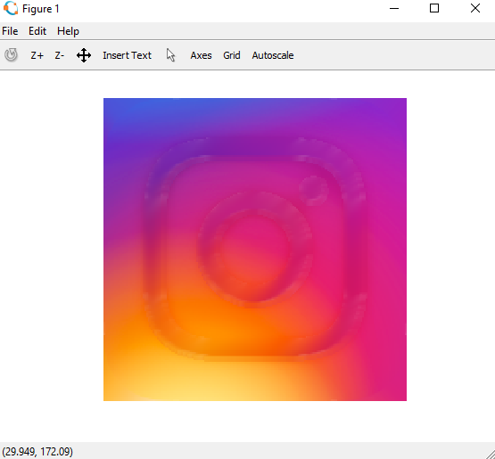

# MATLAB-Image-Restore

### Image Processing

Restore the given image by removing the noise (taken as white part).
--------
* I have taken an image and tried to remove its white part by mixing it with the surrounding.
* I searched for grey & white pixel and then took average of its surrounding pixel which were not grey or white.
* I took average of 25 neighbouring pixels but set 9 neighbouring pixels that averaged value.
* This was based on hit and trial to achieve the best result.

### Original Image 

### Restored Image

